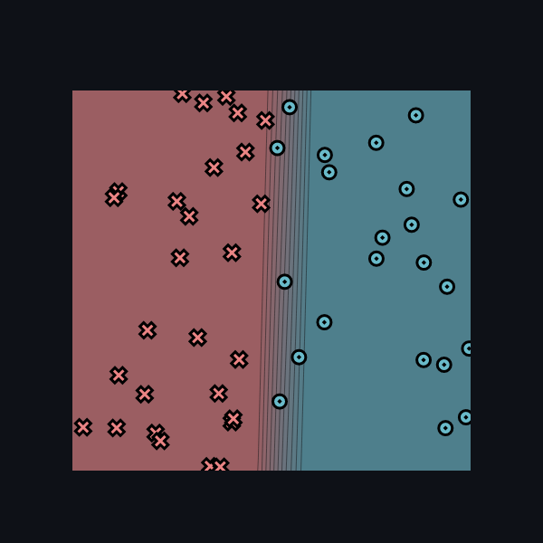
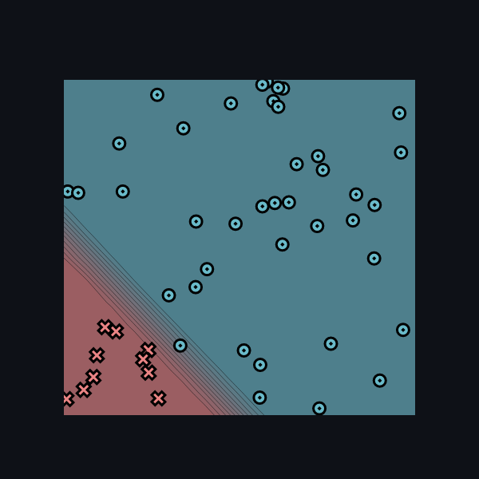
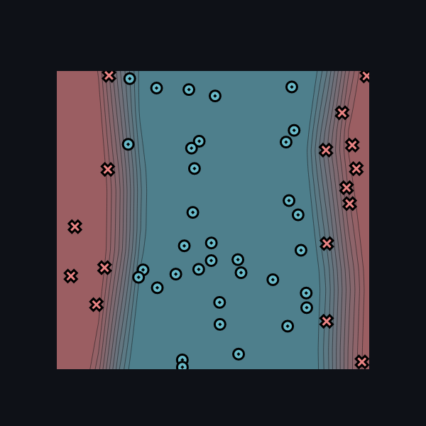
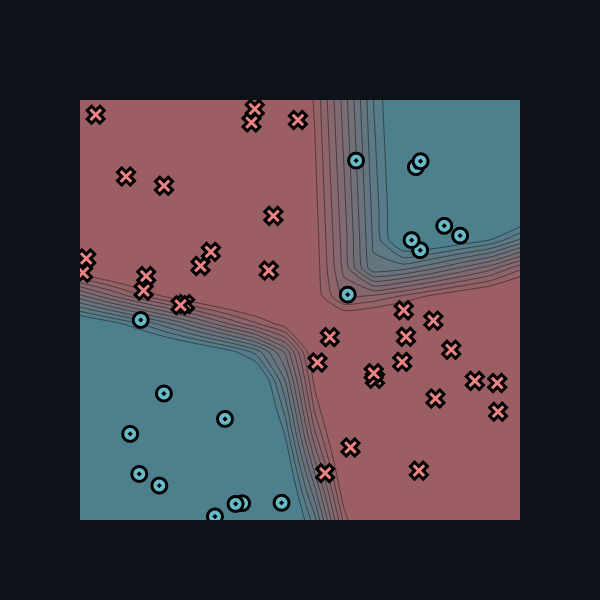

[](https://classroom.github.com/online_ide?assignment_repo_id=8805139&assignment_repo_type=AssignmentRepo)
# MiniTorch Module 2


* Docs: https://minitorch.github.io/

* Overview: https://minitorch.github.io/module2/module2/

This assignment requires the following files from the previous assignments. You can get these by running

```bash
python sync_previous_module.py previous-module-dir current-module-dir
```

The files that will be synced are:

        minitorch/operators.py minitorch/module.py minitorch/autodiff.py minitorch/scalar.py minitorch/module.py project/run_manual.py project/run_scalar.py

### Simple
| 0  | 500 | 5.9114  | 50 |
|----|-----|---------|----|
| 1  | 490 | 6.0819  | 50 |
| 2  | 480 | 6.2611  | 50 |
| 3  | 470 | 6.4489  | 50 |
| 4  | 460 | 6.6458  | 50 |
| 5  | 450 | 6.8523  | 49 |
| 6  | 440 | 7.0690  | 49 |
| 7  | 430 | 7.2965  | 49 |
| 8  | 420 | 7.5354  | 49 |
| 9  | 410 | 7.7875  | 49 |
| 10 | 400 | 8.0542  | 49 |
| 11 | 390 | 8.3357  | 49 |
| 12 | 380 | 8.6335  | 49 |
| 13 | 370 | 8.9527  | 49 |
| 14 | 360 | 9.2970  | 49 |
| 15 | 350 | 9.6676  | 49 |
| 16 | 340 | 10.0752 | 49 |
| 17 | 330 | 10.5208 | 48 |
| 18 | 320 | 10.9968 | 48 |
| 19 | 310 | 11.5187 | 48 |
| 20 | 300 | 12.0780 | 47 |
| 21 | 290 | 12.6682 | 47 |
| 22 | 280 | 13.2892 | 47 |
| 23 | 270 | 13.9397 | 47 |
| 24 | 260 | 14.6177 | 46 |
| 25 | 250 | 15.3222 | 46 |
| 26 | 240 | 16.0566 | 45 |
| 27 | 230 | 16.8179 | 45 |
| 28 | 220 | 17.6019 | 45 |
| 29 | 210 | 18.4148 | 44 |
| 30 | 200 | 19.2962 | 44 |
| 31 | 190 | 20.2141 | 44 |
| 32 | 180 | 21.1931 | 44 |
| 33 | 170 | 22.1819 | 42 |
| 34 | 160 | 23.1815 | 42 |
| 35 | 150 | 24.1935 | 42 |
| 36 | 140 | 25.2170 | 42 |
| 37 | 130 | 26.2394 | 41 |
| 38 | 120 | 27.1939 | 41 |
| 39 | 110 | 28.0938 | 38 |
| 40 | 100 | 28.9372 | 36 |
| 41 | 90  | 29.6836 | 28 |
| 42 | 80  | 30.3452 | 28 |
| 43 | 70  | 30.9273 | 28 |
| 44 | 60  | 31.4426 | 28 |
| 45 | 50  | 31.9003 | 28 |
| 46 | 40  | 32.3083 | 28 |
| 47 | 30  | 32.6869 | 28 |
| 48 | 20  | 33.0622 | 28 |
| 49 | 10  | 33.3969 | 28 |



### Diag

| 0  | 700 | 2.5058  | 50 |
|----|-----|---------|----|
| 1  | 690 | 2.5570  | 50 |
| 2  | 680 | 2.6101  | 50 |
| 3  | 670 | 2.6651  | 50 |
| 4  | 660 | 2.7221  | 50 |
| 5  | 650 | 2.7812  | 50 |
| 6  | 640 | 2.8426  | 50 |
| 7  | 630 | 2.9063  | 50 |
| 8  | 620 | 2.9723  | 50 |
| 9  | 610 | 3.0410  | 50 |
| 10 | 600 | 3.1124  | 50 |
| 11 | 590 | 3.1866  | 50 |
| 12 | 580 | 3.2637  | 50 |
| 13 | 570 | 3.3440  | 50 |
| 14 | 560 | 3.4275  | 50 |
| 15 | 550 | 3.5148  | 50 |
| 16 | 540 | 3.6060  | 50 |
| 17 | 530 | 3.7015  | 50 |
| 18 | 520 | 3.8024  | 50 |
| 19 | 510 | 3.9079  | 50 |
| 20 | 500 | 4.0182  | 50 |
| 21 | 490 | 4.1336  | 50 |
| 22 | 480 | 4.2553  | 50 |
| 23 | 470 | 4.3825  | 50 |
| 24 | 460 | 4.5170  | 50 |
| 25 | 450 | 4.6578  | 50 |
| 26 | 440 | 4.8059  | 50 |
| 27 | 430 | 4.9610  | 50 |
| 28 | 420 | 5.1268  | 50 |
| 29 | 410 | 5.3004  | 50 |
| 30 | 400 | 5.4871  | 50 |
| 31 | 390 | 5.6825  | 50 |
| 32 | 380 | 5.8899  | 50 |
| 33 | 370 | 6.1125  | 50 |
| 34 | 360 | 6.3464  | 50 |
| 35 | 350 | 6.5914  | 50 |
| 36 | 340 | 6.8526  | 50 |
| 37 | 330 | 7.1328  | 50 |
| 38 | 320 | 7.4470  | 49 |
| 39 | 310 | 7.7869  | 49 |
| 40 | 300 | 8.1765  | 49 |
| 41 | 290 | 8.6134  | 49 |
| 42 | 280 | 9.0753  | 47 |
| 43 | 270 | 9.5633  | 45 |
| 44 | 260 | 10.0785 | 45 |
| 45 | 250 | 10.6221 | 44 |
| 46 | 240 | 11.1978 | 40 |
| 47 | 230 | 11.8079 | 40 |
| 48 | 220 | 12.4569 | 40 |
| 49 | 210 | 13.1286 | 40 |
| 50 | 200 | 13.8198 | 40 |
| 51 | 190 | 14.5282 | 40 |
| 52 | 180 | 15.2593 | 40 |
| 53 | 170 | 16.0070 | 40 |
| 54 | 160 | 16.7515 | 40 |
| 55 | 150 | 17.4771 | 40 |
| 56 | 140 | 18.1812 | 40 |
| 57 | 130 | 18.8637 | 40 |
| 58 | 120 | 19.5210 | 40 |
| 59 | 110 | 20.1349 | 40 |
| 60 | 100 | 20.7012 | 40 |
| 61 | 90  | 21.2214 | 40 |
| 62 | 80  | 21.6961 | 40 |
| 63 | 70  | 22.1263 | 40 |
| 64 | 60  | 22.5123 | 40 |
| 65 | 50  | 22.8518 | 40 |
| 66 | 40  | 23.1498 | 40 |
| 67 | 30  | 23.4151 | 40 |
| 68 | 20  | 23.6506 | 40 |
| 69 | 10  | 23.8633 | 40 |



### Split

| 0  | 430 | 8.6124  | 50 |
|----|-----|---------|----|
| 1  | 420 | 8.9497  | 50 |
| 2  | 410 | 9.3090  | 50 |
| 3  | 400 | 9.6921  | 49 |
| 4  | 390 | 10.1017 | 48 |
| 5  | 380 | 10.5413 | 48 |
| 6  | 370 | 11.0124 | 48 |
| 7  | 360 | 11.5174 | 48 |
| 8  | 350 | 12.0585 | 48 |
| 9  | 340 | 12.6371 | 48 |
| 10 | 330 | 13.2555 | 48 |
| 11 | 320 | 13.9136 | 48 |
| 12 | 310 | 14.6109 | 46 |
| 13 | 300 | 15.3437 | 46 |
| 14 | 290 | 16.1091 | 45 |
| 15 | 280 | 16.9028 | 44 |
| 16 | 270 | 17.7163 | 44 |
| 17 | 260 | 18.5486 | 44 |
| 18 | 250 | 19.3980 | 43 |
| 19 | 240 | 20.2655 | 43 |
| 20 | 230 | 21.1631 | 41 |
| 21 | 220 | 22.1269 | 41 |
| 22 | 210 | 22.9132 | 41 |
| 23 | 200 | 23.6234 | 41 |
| 24 | 190 | 24.3137 | 41 |
| 25 | 180 | 24.9041 | 41 |
| 26 | 170 | 25.4453 | 40 |
| 27 | 160 | 25.8888 | 40 |
| 28 | 150 | 26.2942 | 39 |
| 29 | 140 | 26.6816 | 39 |
| 30 | 130 | 27.0466 | 38 |
| 31 | 120 | 27.3928 | 36 |
| 32 | 110 | 27.7337 | 35 |
| 33 | 100 | 28.0818 | 34 |
| 34 | 90  | 28.4324 | 34 |
| 35 | 80  | 28.7912 | 34 |
| 36 | 70  | 29.1517 | 34 |
| 37 | 60  | 29.4828 | 34 |
| 38 | 50  | 29.8637 | 34 |
| 39 | 40  | 30.2844 | 34 |
| 40 | 30  | 30.7307 | 34 |
| 41 | 20  | 31.3976 | 34 |
| 42 | 10  | 32.3729 | 34 |



### Xor

| 0  | 550 | 4.8052  | 50 |
|----|-----|---------|----|
| 1  | 540 | 4.9259  | 50 |
| 2  | 530 | 5.0524  | 50 |
| 3  | 520 | 5.1944  | 49 |
| 4  | 510 | 5.3391  | 49 |
| 5  | 500 | 5.4728  | 49 |
| 6  | 490 | 5.6192  | 49 |
| 7  | 480 | 5.7831  | 48 |
| 8  | 470 | 5.9343  | 48 |
| 9  | 460 | 6.1012  | 48 |
| 10 | 450 | 6.2633  | 48 |
| 11 | 440 | 6.4404  | 48 |
| 12 | 430 | 6.6262  | 48 |
| 13 | 420 | 6.8298  | 48 |
| 14 | 410 | 7.0376  | 48 |
| 15 | 400 | 7.2612  | 48 |
| 16 | 390 | 7.5027  | 48 |
| 17 | 380 | 7.7563  | 48 |
| 18 | 370 | 8.0078  | 48 |
| 19 | 360 | 8.2859  | 48 |
| 20 | 350 | 8.5841  | 48 |
| 21 | 340 | 8.9047  | 48 |
| 22 | 330 | 9.2387  | 48 |
| 23 | 320 | 9.5966  | 48 |
| 24 | 310 | 9.9756  | 48 |
| 25 | 300 | 10.3980 | 48 |
| 26 | 290 | 10.8304 | 48 |
| 27 | 280 | 11.3022 | 48 |
| 28 | 270 | 11.7985 | 48 |
| 29 | 260 | 12.3250 | 48 |
| 30 | 250 | 12.8876 | 48 |
| 31 | 240 | 13.4889 | 48 |
| 32 | 230 | 14.1256 | 47 |
| 33 | 220 | 14.7948 | 47 |
| 34 | 210 | 15.5037 | 45 |
| 35 | 200 | 16.2703 | 45 |
| 36 | 190 | 17.0754 | 45 |
| 37 | 180 | 17.8899 | 45 |
| 38 | 170 | 18.8130 | 42 |
| 39 | 160 | 19.7462 | 41 |
| 40 | 150 | 20.6338 | 41 |
| 41 | 140 | 21.4665 | 41 |
| 42 | 130 | 22.2652 | 41 |
| 43 | 120 | 23.0279 | 41 |
| 44 | 110 | 23.7470 | 41 |
| 45 | 100 | 24.4402 | 41 |
| 46 | 90  | 25.1023 | 40 |
| 47 | 80  | 25.7393 | 40 |
| 48 | 70  | 26.3662 | 39 |
| 49 | 60  | 26.9941 | 38 |
| 50 | 50  | 27.6692 | 36 |
| 51 | 40  | 28.4134 | 32 |
| 52 | 30  | 29.4209 | 32 |
| 53 | 20  | 31.3482 | 32 |
| 54 | 10  | 34.6461 | 32 |

